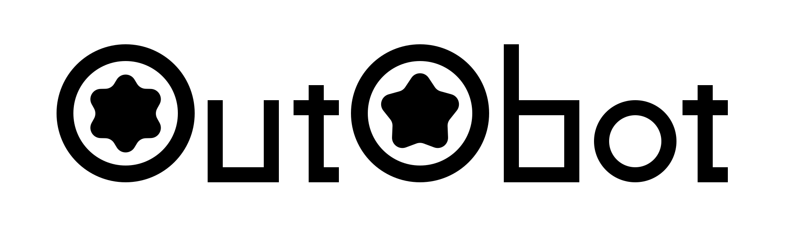

# OutObot - Your Personal AI Agent Team

<p align="center">
  
</p>

OutObot is a multi-agent AI system where multiple AI agents collaborate to complete tasks. Instead of one AI handling everything, specialized agents work together.

## Core Philosophy

1. **Isolated Container**: Agents run in a secure, isolated environment to protect your computer
2. **Multi-Agent**: Multiple agents collaborate, not a single AI
3. **Skill-Centric**: Each agent uses registered skills
4. **Memory**: Remembers previous conversations and continues where you left off
5. **Self-Directed**: Makes decisions autonomously without asking for guidance
6. **Auto-Start**: Runs automatically on system startup
7. **Single Provider**: All agents use the same provider for consistency

## Meet the Agents

| Agent | Role | Description |
|-------|------|-------------|
| **OutObot** | Coordinator | Team lead. Delegates and orchestrates tasks |
| **Peritus** | Professional | General professional work |
| **Inquisitor** | Research | Research and investigation specialist |
| **Rimor** | Explorer | Precise and fast exploration |
| **Recensor** | Review | Review and verification specialist |
| **Cogitator** | Thinking | Deep thinking on complex topics |
| **Creativus** | Creative | Creative problem solving |
| **Artifex** | Artistic | Artistic and design work |

## Getting Started

### Step 1: Install

```bash
curl -sSL https://raw.githubusercontent.com/llaa33219/outobot/main/install.sh | bash
```

This installs everything to `~/.outobot/`

### Step 2: Configure API Keys

Open http://localhost:7227 in your browser.

Go to the **Settings** tab and enter API keys for your preferred AI provider:

- **OpenAI** - GPT models (gpt-5.2, o3, o4-mini)
- **Anthropic** - Claude models (claude-opus-4-6, claude-sonnet-4-6)
- **Google** - Gemini models (gemini-3.1-pro, gemini-3-flash)
- **MiniMax** - Chinese multilingual model (M2.5)
- **GLM** - Chinese bilingual model (GLM-5)
- **Kimi** - Moonshot AI (kimi-k2.5)

Check "Enable", enter your API key, select a model, then click **Save Configuration**.

All agents will use your selected provider.

### Step 3: Use

Now you're ready to chat!

1. Select an agent from the left (default: OutObot)
2. Type a message and click Send
3. The agent will respond

## Features

### Multi-Agent Collaboration
When needed, OutObot automatically delegates to other agents. For example:
- Asks Inquisitor to research
- Has Recensor review the work
- Gets creative suggestions from Creativus

### Conversation Memory
Remembers your previous conversations so you can continue where you left off.

### Session Management
- Conversations are saved automatically
- Load previous conversations from the session list
- Start a new conversation with "New Session"

### Enhanced Agent Loop Display
OutObot shows detailed internal events during agent execution:
- Tool calls with arguments
- Tool results
- Agent delegation with messages
- Agent return results
- Error events

## Troubleshooting

### "No providers configured" error?
Go to Settings tab and enable at least one provider with your API key.

### Other issues?
Check settings at http://localhost:7227/settings or restart the system.

## Update

Running install.sh again will automatically update to the latest version.

---

## License

Apache License 2.0

Copyright 2026 OutObot Contributors

Licensed under the Apache License, Version 2.0 (the "License");
you may not use this file except in compliance with the License.
You may obtain a copy of the License at

    http://www.apache.org/licenses/LICENSE-2.0

Unless required by applicable law or agreed to in writing, software
distributed under the License is distributed on an "AS IS" BASIS,
WITHOUT WARRANTIES OR CONDITIONS OF ANY KIND, either express or implied.
See the License for the specific language governing permissions and
limitations under the License.
